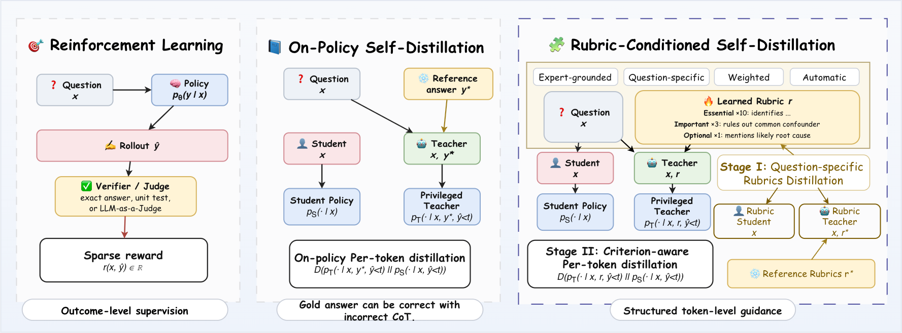

# RCSD: Rubric-Conditioned Self-Distillation

[](https://arxiv.org/abs/2606.19327)

---

## Overview

Training code for **Rubric-Conditioned Self-Distillation (RCSD)**. 



## Installation

```bash
conda env create -f environment.yml
conda activate rcsd
```

```bash
pip install flash-attn==2.8.3 --no-build-isolation
```


## Evaluation

_To be updated._

## Acknowledgements

This codebase builds upon [OPSD](https://github.com/siyan-zhao/OPSD). We thank the authors for open-sourcing their code.
